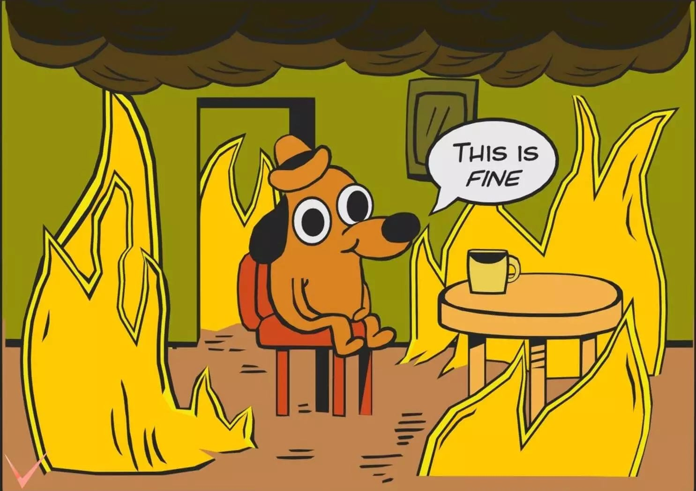

# Cvičenie: Git v tíme – študentské portfólio

Tento projekt slúži ako základ na precvičenie práce s Gitom a GitHubom v tíme.

## 💡 Úloha 1: Vlastná sekcia (vetva a pull request)
1. Forkni si tento repozitár alebo ho klonuj (ak už si člen tímu).
2. Vytvor si vetvu s názvom `feature-<meno>-section`.
3. Do súboru `index.html` pridaj svoju vlastnú sekciu s krátkym textom o tebe.
4. V `style.css` uprav farbu pozadia alebo písma tvojej sekcie.
5. V `script.js` pridaj jednoduchú interaktivitu (napr. zmena farby po kliknutí).
6. Commitni a pushni zmeny.
7. Otvor pull request do `main` vetvy.

## 💡 Úloha 2: Merge konflikt
1. Všetci študenti upravia prvź `
` v `index.html` na niečo vlastné.
2. Commitni zmeny v novej vetve (`feature-merge-conflict`).
3. Vytvor pull request do `main`.
4. Prvý, kto mergne, bude v poriadku. Ostatní budú mať **merge conflict**.
5. Vyrieš konflikt ručne a dokonči merge.

## 💡 Úloha 3: Spolupráca s cherry-pick a revert
1. Vytvorte tímovú vetvu `feature-team-about`.
2. Študent A pridá novú sekciu "O nás" do `index.html`.
3. Študent B vytvorí commit (napr. animáciu) ale **na zlej vetve** (`feature-<meno>-section`) – musí použiť `git cherry-pick`, aby ju dostal na správne miesto -> `feature-team-about`.

## 💡 Úloha 4: Všetko na projekte začalo horieť
1. Otvor si vetvu `main-bug` s chybou v strede stránky.
2. Vašou úlohou bude túto vetvu opraviť:
   - Buď cez `git revert`
   - Alebo vrátením sa do predchádzajúceho commitu (`git checkout` + `push`)

   

---

## 🧠 Užitočné Git príkazy
- `git clone`
- `git branch`, `git checkout -b`, `git switch`
- `git add .`, `git commit -m`, `git push`
- `git pull`
- `git log`, `git diff`
- `git revert`, `git cherry-pick`, `git reset`, `git checkout`

---

Veľa šťastia a bavte sa! 🚀
